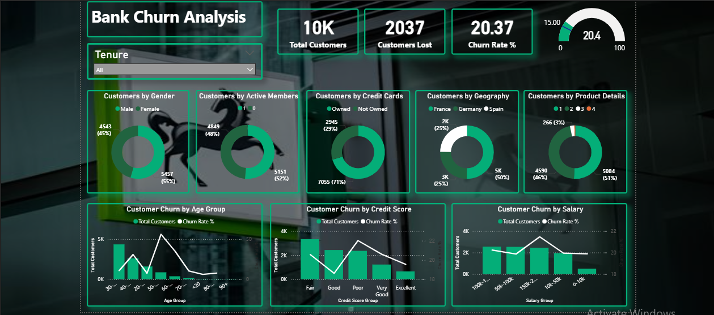

## 🧠 Key Insights

- 📉 **Churn Rate:**  
  The overall churn rate is **20.37%**, with **2,037 out of 10,000 customers lost**.

- 👥 **Gender Distribution:**  
  - Slightly more female customers (**54.5%**) than male customers.  
  - Churn appears evenly distributed across genders.

- 🔘 **Active Membership Matters:**  
  - Active members are less likely to churn:  
    - **51.5%** are active (5,151 customers).  
    - Inactive customers show higher churn rates.

- 💳 **Credit Card Ownership:**  
  - **71%** of customers own credit cards.  
  - Those **without credit cards** tend to have higher churn rates,  
    suggesting credit card engagement may improve retention.

- 🌍 **Geography-wise Churn:**  
  - **France** has the highest customer base (**50%**) and a relatively higher churn  
    compared to **Germany** and **Spain**.  
  - Localization strategies may be required to reduce churn in French regions.

- 📦 **Product Holding Impact:**  
  - Most customers hold either **1 or 2 products**.  
  - Customers with **only 1 product** have the **highest churn**,  
    indicating low engagement leads to higher attrition.

- 🧓 **Customer Churn by Age Group:**  
  - Younger customers (**20s and early 30s**) show lower churn.  
  - **Churn spikes significantly in the 40–50 age group**,  
    making it a key segment for retention initiatives.

- 🏦 **Credit Score Influence:**  
  - Churn is highest in the **“Good” and “Poor”** credit score ranges.  
  - Surprisingly, **Fair** and **Excellent** score groups exhibit lower churn rates.

- 💰 **Salary vs. Churn:**  
  - The **$150K–$200K** income group shows the **highest churn rate**.  
  - Churn is relatively lower among both lower (<$50K) and higher (> $200K) income groups.

Churn by Gender: Both genders showed similar churn rates, but slight variations suggest the possibility of gender-specific retention efforts, with different financial product preferences.

Key Achievements Comprehensive Churn Analysis: The analysis provided a complete picture of customer churn based on various factors, helping the business understand the key risk areas for customer attrition. KPI Development: Using DAX measures, important metrics like churn rate, total customers, and lost customers were defined and could be monitored regularly. Interactive Slicers: Allowed users to filter and explore different combinations of demographic and financial data, giving a deeper understanding of churn patterns. Data Cleaning & Preprocessing: Structured the data effectively to ensure accurate analysis and meaningful insights.
